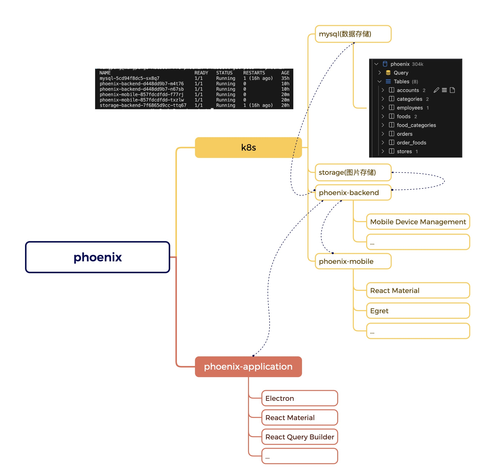
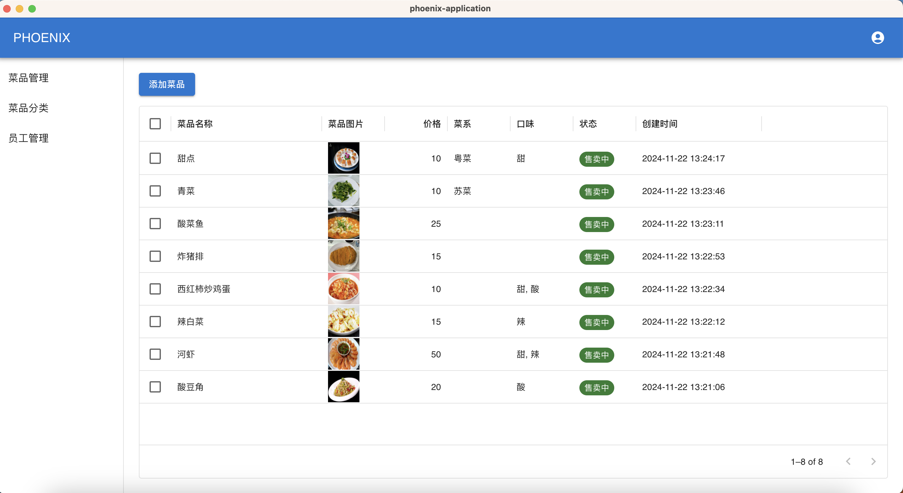
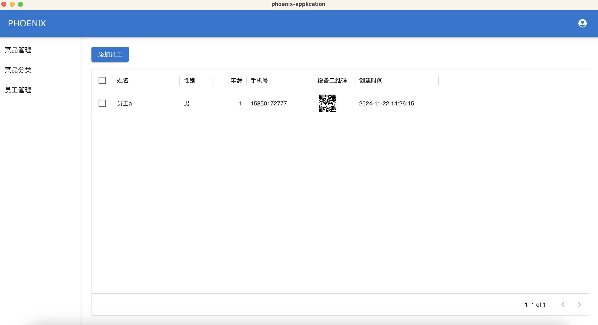
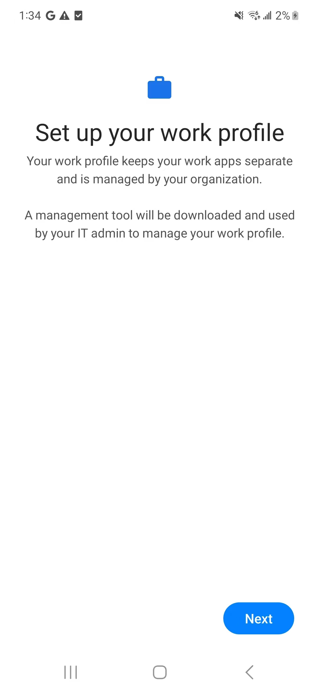
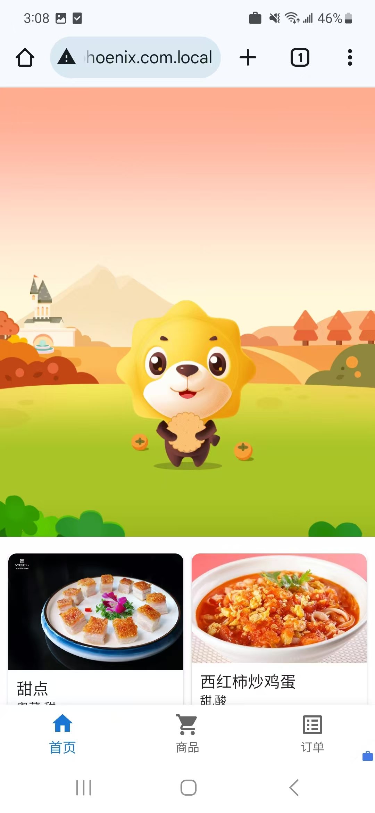
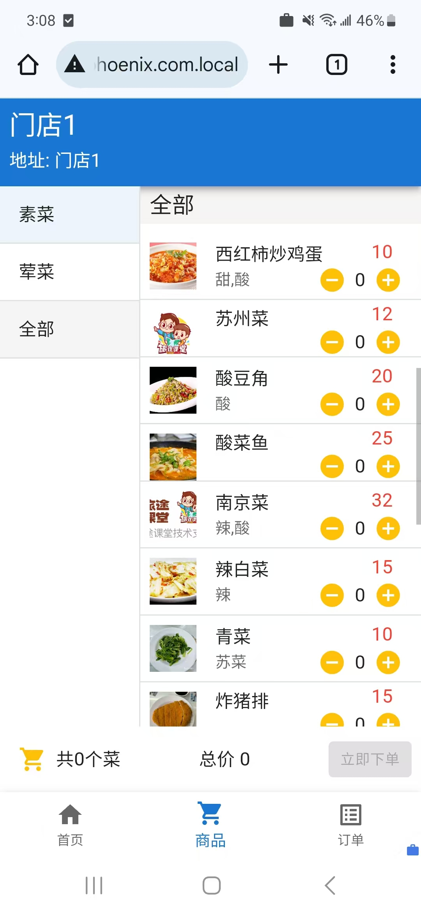

# phoenix

demo video https://hswx.github.io/phoenix/

    
    
    

## features
1. k8s(一主二从)
2. phoenix-application: 使用electron包装，主体框架为React+Material-UI，实现店铺注册，菜品添加，分类以及员工管理，员工设备分发
3. phoenix-mobile(2 pods): 页面主体为React+Material-UI，首页增加egret游戏引擎，通过骨骼动画实现小狮子的运动，其它功能包括点餐和订单查询。该页面通过员工管理页面分发，在员工手机上开辟工作空间安装特制浏览器，浏览器home页面设置为phoenix-mobile页面
4. phoenix-backend(2 pods): express框架，实现electron客户端以及mobile页面的功能，其中包括通过google mdm实现移动设备管理进而下发员工专属chrome浏览器，chrome的home页即为点餐页面
5. storage-backend(1 pods): 存储图片
6. 其它功能正在继续开发中
